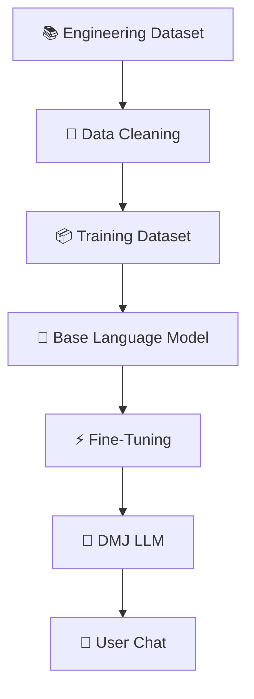

<!-- ========================================================= -->
<!--                        DMJ LLM                            -->
<!-- ========================================================= -->

<div align="center">

# 🤖 DMJ LLM

### Engineering • Robotics • Embedded Systems • Programming • Artificial Intelligence

*A lightweight, open-source engineering-focused Large Language Model built for students, makers, developers, and researchers.*

<br>


<br>


<br>


<br>


</div>

---

# 🚀 About DMJ LLM

DMJ LLM is an open-source engineering-focused Large Language Model designed to provide high-quality technical assistance across programming, electronics, robotics, embedded systems, artificial intelligence, and engineering.

Unlike general-purpose language models, DMJ LLM is developed with a strong emphasis on technical education, practical problem-solving, and hardware-software integration.

The project aims to become a capable AI assistant for:

- 👨‍🎓 Students
- 👨‍💻 Developers
- 🤖 Robotics Engineers
- ⚡ Electronics Enthusiasts
- 🔧 Embedded Engineers
- 🛰️ IoT Developers
- 📚 Researchers
- 🏭 Industrial Automation Learners

---

# ✨ Features

## 🧠 Technical Knowledge

- Programming Languages
- Embedded Systems
- Robotics
- Electronics
- Artificial Intelligence
- Machine Learning
- Linux
- Raspberry Pi
- Arduino
- ESP32
- Microcontrollers
- PLC Programming
- IoT Development
- Sensors
- Automation

---

## ⚡ Capabilities

- 💬 Natural Conversations
- 🧠 Technical Explanations
- 🛠️ Debugging Assistance
- 📖 Code Generation
- 🔍 Code Review
- ⚙️ Embedded Development Help
- 📚 Educational Assistance
- 📝 Documentation Generation
- 🤝 Engineering Discussions
- 🚀 Research Assistance

---

# 🎯 Project Goals

The long-term vision of DMJ LLM is to build an open engineering assistant capable of helping students, developers, and professionals with practical engineering tasks.

Our goals include:

- Build a specialized engineering language model.
- Improve reasoning in technical domains.
- Support embedded development workflows.
- Assist with robotics projects.
- Enhance programming education.
- Expand electronics knowledge coverage.
- Provide accurate technical explanations.
- Encourage open-source collaboration.

---

# 🌍 Why DMJ LLM?

General-purpose language models are excellent at many tasks, but engineering often requires specialized knowledge and practical context.

DMJ LLM focuses on:

✅ Engineering

✅ Robotics

✅ Embedded Systems

✅ Electronics

✅ Programming

✅ Artificial Intelligence

✅ Internet of Things (IoT)

✅ Automation

to provide more relevant and focused technical assistance.

---

# ⭐ Key Highlights

| Feature | Status |
|----------|:------:|
| Engineering Knowledge | ✅ |
| Programming Assistance | ✅ |
| Robotics Support | ✅ |
| Electronics | ✅ |
| Embedded Systems | ✅ |
| Arduino | ✅ |
| ESP32 | ✅ |
| Raspberry Pi | ✅ |
| Linux | ✅ |
| AI & ML Concepts | 🚧 |
| Multi-turn Reasoning | 🚧 |
| Vision Support | 🔜 |
| Voice Support | 🔜 |

---

# 📌 Current Development Status

| Version | Status |
|----------|--------|
| Alpha | ✅ Released |
| Dataset Expansion | 🚧 In Progress |
| Fine-tuning | 🚧 Ongoing |
| Documentation | 🚧 Improving |
| Benchmarks | Planned |
| Public Releases | Planned |

---

# ❤️ Open Source

DMJ LLM is built as an open-source project with the goal of encouraging learning, experimentation, collaboration, and innovation in engineering and artificial intelligence.

Contributions from the community are welcome as the project continues to evolve.

---

<div align="center">

## ⭐ If you find this project useful, consider giving it a Star!

It helps the project grow and reach more developers and engineering enthusiasts.

</div>

---

# 🏗️ Project Architecture



The development pipeline is designed to be modular, allowing continuous improvements to datasets, model training, evaluation, and deployment without affecting other components.

---

# ⚙️ High-Level Workflow

```text
               DATA COLLECTION
                      │
                      ▼
              DATA VALIDATION
                      │
                      ▼
               DATA CLEANING
                      │
                      ▼
            DATASET GENERATION
                      │
                      ▼
              MODEL TRAINING
                      │
                      ▼
             MODEL EVALUATION
                      │
                      ▼
              MODEL OPTIMIZATION
                      │
                      ▼
                 DMJ LLM
                      │
                      ▼
              END USER CHATBOT
```

---

# 📂 Repository Structure

```text
DMJ-LLM/
│
├── 📁 assets/
│   ├── banner.png
│   ├── logo.png
│   └── screenshots/
│
├── 📁 dataset/
│   ├── raw/
│   ├── processed/
│   └── dataset.jsonl
│
├── 📁 training/
│   ├── configs/
│   ├── scripts/
│   ├── checkpoints/
│   └── logs/
│
├── 📁 model/
│   ├── adapters/
│   ├── tokenizer/
│   └── merged/
│
├── 📁 docs/
│   ├── architecture.md
│   ├── roadmap.md
│   └── faq.md
│
├── 📁 notebooks/
│
├── 📁 examples/
│
├── 📁 tests/
│
├── 📄 README.md
├── 📄 LICENSE
├── 📄 requirements.txt
└── 📄 .gitignore
```

---

# 🧠 Model Specifications

| Property | Information |
|-----------|-------------|
| Project | DMJ LLM |
| Type | Large Language Model |
| Domain | Engineering & Programming |
| Base Architecture | Transformer |
| Fine-Tuning | LoRA / PEFT |
| Primary Language | English |
| License | Open Source |
| Status | Active Development |

---

# 💻 Technology Stack

| Category | Technologies |
|----------|--------------|
| Programming | Python |
| Deep Learning | PyTorch |
| LLM Framework | Hugging Face Transformers |
| Fine-Tuning | PEFT, LoRA |
| Tokenization | Hugging Face Tokenizers |
| Training | Accelerate |
| Evaluation | Custom Benchmarks |
| Version Control | Git & GitHub |

---

# 🎯 Design Principles

DMJ LLM follows a simple set of engineering principles:

- 📖 Easy to understand
- 🚀 Fast experimentation
- 🧩 Modular architecture
- 🔒 Reproducible training
- 🌍 Open-source first
- 📚 Education focused
- ⚡ Lightweight deployment
- 🛠️ Developer friendly

---

# 🏛️ System Components

```text
+-------------------------------------------------------+
|                    DMJ LLM Project                    |
+-------------------------------------------------------+

        +---------------------------+
        |      Dataset Module       |
        +---------------------------+

                    │

        +---------------------------+
        |    Training Pipeline      |
        +---------------------------+

                    │

        +---------------------------+
        |      Fine-Tuning          |
        +---------------------------+

                    │

        +---------------------------+
        |       Model Weights       |
        +---------------------------+

                    │

        +---------------------------+
        |     Inference Engine      |
        +---------------------------+

                    │

        +---------------------------+
        |      User Interface       |
        +---------------------------+
```

---

# 📊 Project Pipeline


---

# 🔬 Core Modules

| Module | Purpose |
|---------|----------|
| Dataset | Stores training data |
| Training | Fine-tuning scripts |
| Model | Final weights and adapters |
| Examples | Demo prompts |
| Docs | Project documentation |
| Assets | Images and branding |
| Tests | Validation scripts |

---

# 📈 Scalability

The project has been designed with future expansion in mind.

Planned improvements include:

- Multi-language support
- Larger datasets
- Better reasoning
- Function calling
- Tool integration
- Vision capabilities
- Voice interface
- Web interface
- Mobile applications
- API deployment

---

# 🔐 Open Development

The project follows transparent and community-driven development.

Every major improvement is tracked through GitHub Issues, Pull Requests, and version milestones to encourage collaboration and maintain high-quality contributions.

---

<div align="center">

## 🚀 Building the Future of Engineering AI

*"Learn • Build • Innovate • Share"*

</div>

---

---

# 🚀 Getting Started

Follow the steps below to set up DMJ LLM on your local machine.

---

## 📋 Prerequisites

Before you begin, ensure you have the following installed:

| Software | Version |
|----------|---------|
| Python | 3.11+ |
| Git | Latest |
| pip | Latest |
| Virtual Environment | Recommended |

---

# 📥 Clone the Repository

```bash
git clone https://github.com/DMJ-Group/DMJ-LLM.git

cd DMJ-LLM
```

---

# 📦 Create a Virtual Environment

### Windows

```bash
python -m venv .venv

.venv\Scripts\activate
```

### Linux / macOS

```bash
python3 -m venv .venv

source .venv/bin/activate
```

---

# 📚 Install Dependencies

```bash
pip install -r requirements.txt
```

---

# ✅ Verify Installation

```bash
python --version

pip --version
```

If everything is installed correctly, you're ready to use DMJ LLM.

---

# ⚡ Quick Start

After installation, you can begin experimenting with the project.

```bash
python main.py
```

or

```bash
python app.py
```

depending on your project structure.

---

# 💻 Usage

DMJ LLM is designed to answer engineering and programming questions.

Example topics include:

- Python
- C++
- Arduino
- ESP32
- PLC
- Robotics
- Embedded Systems
- Linux
- IoT
- Raspberry Pi
- Electronics

---

# 💬 Example Conversation

### User

```text
Explain Pulse Width Modulation.
```

### DMJ LLM

```text
Pulse Width Modulation (PWM) is a technique used to control the average voltage delivered to a load by rapidly switching a digital signal between ON and OFF states.

Common applications include:

• Motor speed control
• LED brightness adjustment
• Servo motors
• Switching power supplies
• Audio amplification

The duty cycle determines the effective output voltage.
```

---

### User

```text
Write a Python function to reverse a string.
```

### DMJ LLM

```python
def reverse_string(text):
    return text[::-1]
```

---

### User

```text
What is the difference between Arduino Uno and ESP32?
```

### DMJ LLM

```text
Arduino Uno

• 8-bit AVR
• Lower memory
• Easy for beginners

ESP32

• Dual-core 32-bit processor
• Wi-Fi + Bluetooth
• Much faster
• More GPIO
• Better for IoT projects
```

---

# 🖼️ Screenshots

Project screenshots will be added here.

```
assets/screenshots/
```

Example:

```
📷 Chat Interface

📷 Terminal Output

📷 Training Progress

📷 Model Evaluation

📷 Dashboard
```

---

# ⚙️ Configuration

Future configuration options will allow customization of:

- Model selection
- Inference parameters
- Temperature
- Top-K
- Top-P
- Max Tokens
- Context Length
- GPU Selection

---

# 📂 Example Project Layout

```
examples/

├── chatbot.py
├── engineering_assistant.py
├── robotics_demo.py
├── code_generation.py
└── electronics_qa.py
```

---

# 📚 Documentation

Project documentation can be found inside the **docs/** directory.

Topics include:

- Installation
- Dataset
- Training
- Fine-Tuning
- Evaluation
- Deployment
- FAQ

---

# 🔧 Development Workflow

```text
Clone Repository

↓

Install Dependencies

↓

Prepare Dataset

↓

Train Model

↓

Evaluate

↓

Optimize

↓

Release
```

---

# 📈 Versioning

| Version | Description |
|----------|-------------|
| v0.1 | Initial Project |
| v0.2 | Dataset Expansion |
| v0.3 | Fine-Tuning Improvements |
| v0.4 | Evaluation |
| v1.0 | Stable Release |

---

# 🛠️ Coding Standards

The project follows modern Python development practices.

✔ PEP 8

✔ Type Hints

✔ Modular Design

✔ Clean Code

✔ Readable Documentation

✔ Consistent Formatting

---

# 🎯 Best Practices

When contributing to DMJ LLM:

- Write clean code
- Keep commits meaningful
- Add documentation
- Test changes
- Follow project structure
- Open Pull Requests for review

---

# 📖 Learning Resources

Recommended technologies to understand this project:

- Python
- PyTorch
- Hugging Face
- Transformers
- LoRA
- PEFT
- Machine Learning
- Deep Learning
- Git
- Linux

---

# 💡 Tips

⭐ Use a GPU when training.

⭐ Keep your dataset clean.

⭐ Track experiments.

⭐ Document changes.

⭐ Backup checkpoints regularly.

⭐ Test before releasing.

---

<div align="center">

## 🚀 Ready to Build?

Start exploring the code, experiment with training, and contribute to the future of engineering-focused AI.

</div>

---
---

# 📚 Dataset

The quality of any language model depends heavily on the quality of its training data.

DMJ LLM is trained using carefully curated engineering and programming datasets designed to improve technical reasoning, problem solving, and educational assistance.

---

## 📖 Dataset Coverage

The dataset currently focuses on multiple engineering and computer science domains.

| Domain | Status |
|---------|:------:|
| Python | ✅ |
| C++ | ✅ |
| Arduino | ✅ |
| ESP32 | ✅ |
| Raspberry Pi | ✅ |
| Linux | ✅ |
| Git | ✅ |
| Electronics | ✅ |
| Sensors | ✅ |
| Robotics | ✅ |
| Mechatronics | ✅ |
| Embedded Systems | ✅ |
| PLC | 🚧 |
| Artificial Intelligence | 🚧 |
| Machine Learning | 🚧 |
| Computer Vision | 🔜 |
| Networking | 🔜 |
| Cyber Security | 🔜 |

---

# 📊 Dataset Philosophy

DMJ LLM emphasizes **quality over quantity**.

The dataset is designed to prioritize:

- Accurate technical explanations
- Beginner-friendly concepts
- Advanced engineering discussions
- Real-world programming examples
- Practical electronics knowledge
- Embedded development
- Robotics workflows
- Industrial automation

---

# 📦 Dataset Format

The project uses a structured instruction-following format.

Example:

```json
{
  "instruction": "Explain Pulse Width Modulation.",
  "input": "",
  "output": "Pulse Width Modulation (PWM) is..."
}
```

or conversational format:

```json
{
  "messages": [
    {
      "role": "user",
      "content": "Explain PWM."
    },
    {
      "role": "assistant",
      "content": "PWM is..."
    }
  ]
}
```

---

# 🧹 Data Quality

Every dataset undergoes multiple quality checks before training.

✔ Duplicate Removal

✔ Invalid Entry Detection

✔ Formatting Validation

✔ JSON Verification

✔ Response Consistency

✔ Instruction Cleaning

✔ Content Normalization

---

# 🏋️ Training

DMJ LLM is designed to support modern fine-tuning workflows.

Current workflow:

```text
Engineering Dataset
        │
        ▼
Dataset Validation
        │
        ▼
Dataset Cleaning
        │
        ▼
Instruction Formatting
        │
        ▼
Tokenizer
        │
        ▼
Fine-Tuning
        │
        ▼
Evaluation
        │
        ▼
DMJ LLM
```

---

## ⚙️ Training Features

- LoRA Fine-Tuning
- PEFT Support
- Hugging Face Transformers
- Mixed Precision
- Gradient Checkpointing
- Resume Training
- Modular Configuration
- GPU Acceleration

---

# 📈 Performance Goals

The project aims to continuously improve performance in engineering tasks.

Target improvements include:

| Capability | Goal |
|------------|------|
| Programming | ⭐⭐⭐⭐⭐ |
| Electronics | ⭐⭐⭐⭐⭐ |
| Robotics | ⭐⭐⭐⭐⭐ |
| Embedded Systems | ⭐⭐⭐⭐⭐ |
| Technical Reasoning | ⭐⭐⭐⭐⭐ |
| General Chat | ⭐⭐⭐⭐ |
| Mathematics | ⭐⭐⭐⭐ |
| Code Generation | ⭐⭐⭐⭐⭐ |

---

# 🧠 Model Card

| Property | Value |
|-----------|-------|
| Project Name | DMJ LLM |
| Category | Large Language Model |
| Purpose | Engineering Assistant |
| Language | English |
| Training Type | Instruction Fine-Tuning |
| Architecture | Transformer |
| License | Open Source |
| Status | Active Development |

---

# 🛣️ Roadmap

## ✅ Phase 1

- Initial Repository
- Documentation
- Dataset Pipeline
- Project Structure

---

## 🚧 Phase 2

- Larger Dataset
- Improved Fine-Tuning
- Better Responses
- More Engineering Topics

---

## 🔄 Phase 3

- Better Reasoning
- Multi-turn Conversations
- Faster Inference
- Improved Code Generation

---

## ⭐ Phase 4

- Vision Support
- Voice Support
- Tool Calling
- Function Calling
- Web Interface

---

## 🚀 Phase 5

- Public API
- Desktop Application
- Mobile App
- Cloud Deployment
- Community Models

---

# 📊 Benchmark Goals

Future releases will include benchmarking against engineering-focused evaluation tasks.

Metrics planned:

- Response Accuracy
- Technical Correctness
- Programming Quality
- Hallucination Rate
- Reasoning Score
- Response Time

---

# 🤝 Contributing

We welcome contributions from developers, students, researchers, and engineers.

You can contribute by:

- Improving documentation
- Reporting bugs
- Suggesting new features
- Expanding datasets
- Writing examples
- Improving training scripts
- Optimizing inference

---

# 🌟 Community

Ways to support the project:

⭐ Star the repository

🍴 Fork the project

🐞 Report issues

💡 Suggest ideas

🛠️ Submit Pull Requests

📖 Improve documentation

---

# 📜 License

This project is released under the **MIT License**.

You are free to:

- Use
- Modify
- Distribute
- Learn from
- Build upon

while respecting the terms of the license.

---

# ❤️ Acknowledgements

Special thanks to the open-source AI community whose tools, libraries, and research make projects like DMJ LLM possible.

This project builds upon the broader ecosystem of modern machine learning and natural language processing technologies.

---

<div align="center">

# ⭐ Support DMJ LLM

If you find this project helpful:

⭐ Star this repository

🍴 Fork the project

💬 Share feedback

🚀 Contribute to development

Every contribution helps improve the future of open engineering AI.

---

### Made with ❤️ by the DMJ Group

*"Engineering Intelligence for Everyone."*

</div>

---

